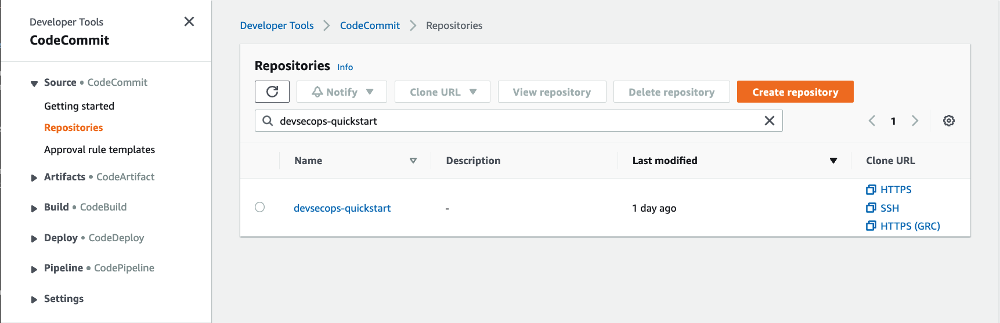
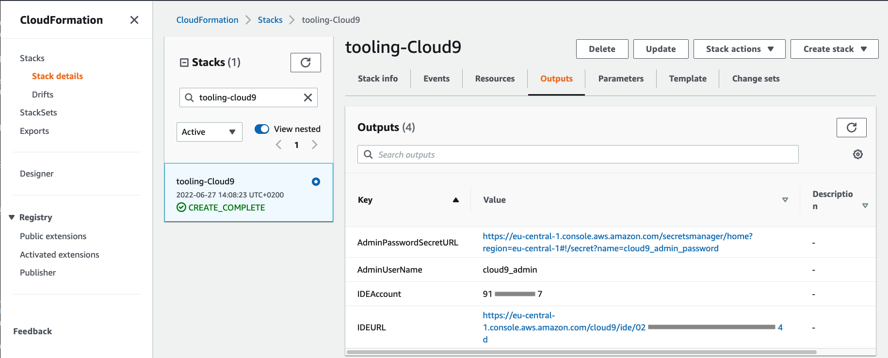
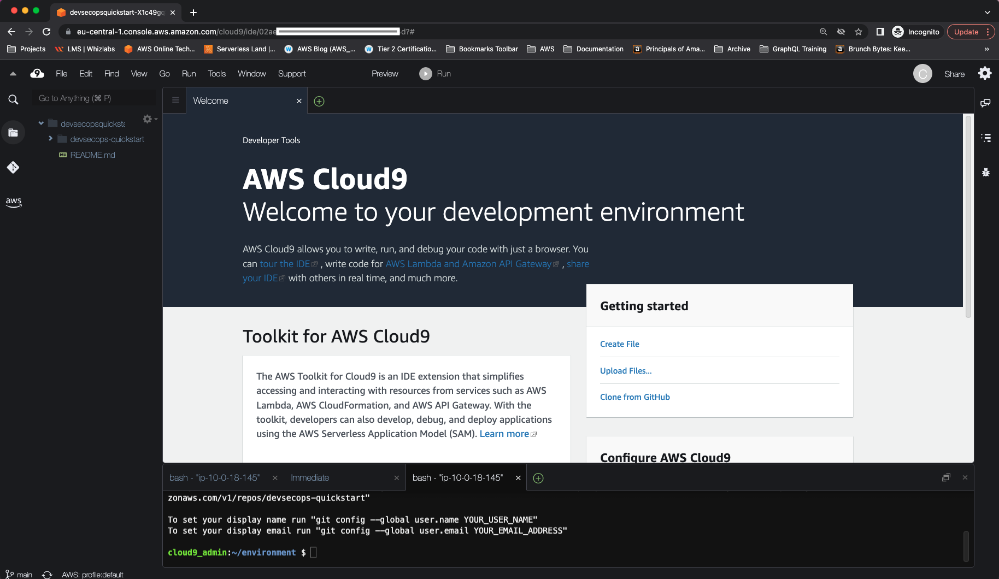
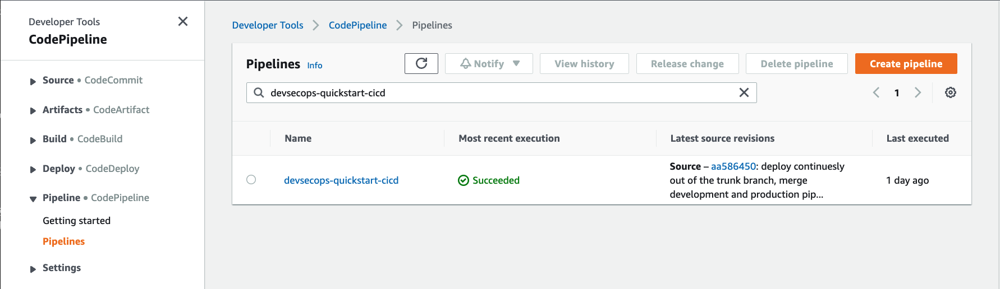
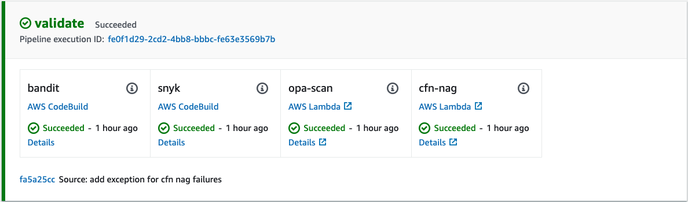
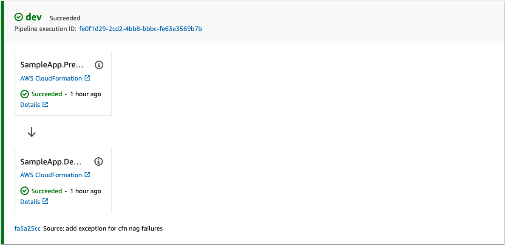
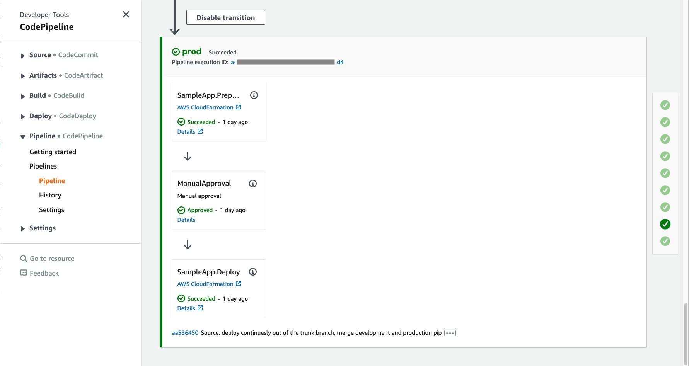
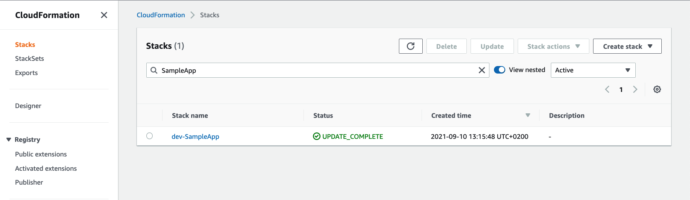

# DevSecOps Quick Start

This artefact helps development teams to quickly set up a ready to use environment integrated with a
multi-account CI/CD pipeline following security and DevOps best practices.


Upon successful deployment, you will have:

- an AWS CodeCommit Git repository 
- an AWS Cloud9 development environment integrated with the code repository
- a multi-stage, multi-account CI/CD pipeline integrated with the code repository  
- pipeline integration with [Bandit](https://github.com/PyCQA/bandit) for finding common security issues in Python code 
- pipeline integration with [Snyk](https://snyk.io/) for continuously monitoring for vulnerabilities in your dependencies
- pipeline integration with [CFN NAG](https://github.com/stelligent/cfn_nag) to look for patterns in 
  CloudFormation templates that may indicate insecure infrastructure
- pipeline integration with [Open Policy Agent (OPA)](https://www.openpolicyagent.org/) that enables you define and
  enforce policies on infrastructure resources at development time

## Prerequisites
- An [AWS Account](https://aws.amazon.com/premiumsupport/knowledge-center/create-and-activate-aws-account/) to be used as `Toolchain` account
- One or more [AWS Account(s)](https://aws.amazon.com/premiumsupport/knowledge-center/create-and-activate-aws-account/) to be used as deployment target accounts (e.g. `Dev`,`QA`,`Prod`, etc.)

> **_NOTE:_**  Separating toolchain and deployment target accounts is technically not required, but is considered as best practice. We encourage you to start with a toolchain and a development account. You can easilty add new target environments to the pipeline in the future, if and when needed. 

- [AWS CLI](https://aws.amazon.com/cli/)
- [Install AWS CDK Toolkit v2](https://docs.aws.amazon.com/cdk/v2/guide/cli.html)
- [Install Python v3.7 or higher](https://www.python.org/downloads/)
- [Install Docker](https://docs.docker.com/get-docker/)
- [Install Go](https://go.dev/doc/install)

## Set UP the Project

### 1. Clone GitHub repository
This project's code repository contains `Git Submodules`. If cloning for the first time, make sure to use
`--recurse-submodules` flag to automatically initialize and update submodules:

```
git clone --recurse-submodules https://github.com/aws-samples/devsecops-quickstart.git
```

If the repository is already cloned without the `--recurse-submodules` flag,
initialize and update submodules by running the following command:

```
git submodule update --init --recursive
``` 

For more information on working with Git repositories with submodules, refere to 
[Git-Tools-Submodules](https://git-scm.com/book/en/v2/Git-Tools-Submodules) documentation.

### 2. Configure accounts and regions
Locate `cdk.json` file on project's root folder. This is the project's configuration file. 
Update `cdk.json` with account number and region values to be used for toolchain, and deployment target accounts. 
The default setting has three deployment target accounts for Dev, QA, and Prod. This is just for demonstration purposes. 
Feel free to add/remove deployment targets according to your requirements. You can for example start with a
single development account and keep adding more stages in the future as requierd.

> **_NOTE:_** Make sure to commit your changes. 

### 3. Set up Python environment
This project is set up like a standard Python project.  The initialization
process also creates a virtualenv within this project, stored under the `.venv`
directory.  To create the virtualenv it assumes that there is a `python3`
(or `python` for Windows) executable in your path with access to the `venv`
package. If for any reason the automatic creation of the virtualenv fails,
you can create the virtualenv manually.

To manually create a virtualenv on MacOS and Linux:

```
python3 -m venv .venv
```

After the init process completes and the virtualenv is created, you can use the following
step to activate your virtualenv.

```
source .venv/bin/activate
```

If you are a Windows platform, you would activate the virtualenv like this:

```
.venv\Scripts\activate.bat
```

Once the virtualenv is activated, you can install the required dependencies.

```
pip install -r requirements.txt
```


## Bootstrap Account(s)
This is a one-time setup known as [Bootstrapping](https://docs.aws.amazon.com/cdk/v2/guide/bootstrapping.html), 
which you need to do for the toolchain and each deployment target account separately. 

Do the following steps for toolchain account+region, that you configured in `cdk.json` in 
step **2. Configure accounts and regions**:

### 4. [Configure AWS CLI](https://docs.aws.amazon.com/cli/latest/userguide/cli-chap-configure.html) to point to the account and region

> **_NOTE:_** This can be quickly done as described in [Quick configuration with aws configure](https://docs.aws.amazon.com/cli/latest/userguide/cli-configure-quickstart.html#cli-configure-quickstart-config) section. Alternatively, you can use 
[AWS CLI Profiles](https://docs.aws.amazon.com/cli/latest/userguide/cli-configure-quickstart.html#cli-configure-quickstart-profiles), which is more convenient when switching back and forth between multiple accounts.

> **_NOTE:_** If you are using AWS CLI profiles, make sure to provide the `--profile <profile_name>` option for every command interacting with AWS accounts below. 

### 5. Run CDK Bootstrap

> **_NOTE:_** Make sure to replace `toolchain_account` and `toolchain_region` placeholders.

```
cdk bootstrap \
  --cloudformation-execution-policies arn:aws:iam::aws:policy/AdministratorAccess \
  aws://<toolchain_account>/<toolchain_region>
```

Repeat the following steps for each deployment target account+region that you configured in `cdk.json` in 
step **2. Configure accounts and regions**:

### 6. [Configure AWS CLI](https://docs.aws.amazon.com/cli/latest/userguide/cli-chap-configure.html) to point to the account and rgion

### 7. Run CDK Bootstrap

> **_NOTE:_** Make sure to replace `<toolchain_account>`, `<deployment_target_account>`, and `<deployment_target_region>` placeholders. 

```
cdk bootstrap \
  --trust <toolchain_account> \
  --cloudformation-execution-policies arn:aws:iam::aws:policy/AdministratorAccess \
  aws://<deployment_target_account>/<deployment_target_region>
```

## Configure Snyk authentication token in toolchain account

For Snyk integration, you need to provide authentication token with a Snyk profile account. You can sign up for a
free Snyk account [here](https://app.snyk.io/login?cta=sign-up&loc=body&page=try-snyk). After sign up, you can get
your Auth Token from the Account Settings section in your profile.

With the Snyk authentication token retrieved, use `create_secret_helper` utility to securely store 
the token in AWS Secret Manager in toolchain account. 
It will be automatically used by the pipeline to interact with Snyk during the pipeline execution.

### 8. [Configure AWS CLI](https://docs.aws.amazon.com/cli/latest/userguide/cli-chap-configure.html) to point to the account and rgion

> **_TODO:_** Pass profile to CLI commands

```
./create_secret_helper.sh snyk-auth-token <snyk-auth-token-value> <toolchain_profile_name>
```

## Seed project's code to toolchain account

### 9. [Configure AWS CLI](https://docs.aws.amazon.com/cli/latest/userguide/cli-chap-configure.html) to point to the account and region 

### 10. Create CodeCommit repository

Create a new Git repository in the toolchain account. This will become the main repository used by the pipeline
for deployments, where you will be developing your application.

```
aws codecommit create-repository --repository-name devsecops-quickstart
```

Take note of `cloneUrlHttp` value in the command output.

### 11. Setup Git Credential Helper for AWS CodeCommit

If this is the first time you are using AWS CodeCommit, you need to configure a Git Credential Helper 
to be able to access CodeCommit repositories using HTTPS. Follow AWS CodeCommit
documentation to set up a credential helper on 
[Linux, macOS, or Unix](https://docs.aws.amazon.com/codecommit/latest/userguide/setting-up-https-unixes.html#setting-up-https-unixes-credential-helper) or 
[Windows](https://docs.aws.amazon.com/codecommit/latest/userguide/setting-up-https-windows.html#setting-up-https-windows-credential-helper).

### 12. Seed CodeCommit repository

> **_NOTE:_** Make sure to replace `<codecommit_repository_url>` placeholder with `cloneUrlHttp` value 
from step **9. Create Git repository**.

```
git remote add codecommit <codecommit_repository_url>
git checkout -b main
git add .
git commit -m "initial commit"
git push --set-upstream codecommit main
```

## Deploy CI/CD pipeline in toolchain account

### 13. [Configure AWS CLI](https://docs.aws.amazon.com/cli/latest/userguide/cli-chap-configure.html) to point to the account and region
### 14. Deploy
Run CDK deploy command to build and deploy the CI/CD pipeline.

```
cdk deploy devsecops-quickstart-cicd
```

## Verify Deployment in Toolchain Account
Login to the toolchain account in AWS Console. Select the same region you used for the deployment.
### AWS CodeCommit Repository

Navigate to AWS CodeCommit service, select Source/Repositories from the left navigation bar, and verify that a new repository has been created.



### AWS Cloud9 Environment
Navigate to AWS Cloud9 service, select Account Environments from the left navigation bar, and verify that a new Cloud9 environment has been created.


Note that `cloud9_admin` is the owner of the environment and Open IDE buttion is disabled. To access the 
Cloud9 environment, go to CloudFormation service, open `tooling-cloud9` stack, and select Outputs section from the top navigation bar.



Copy the `IDEURL` link and open it in a new __incognito__ browser tab. For Sign In select IAM User. For Account number use the `IDEAccount` value from stack outputs, and for IAM user use `AdminUserName`. The Password needs to be retrieved from AWS Secret Manager by following the link in `AdminPasswordSecretURL` and selecting Retrieve Secret Value under Secret Value section. After successful login, you get access to the Cloud9 environment.



### AWS CodePipeline pipeline
Navigate to AWS CodePipeline service, select Pipeline/Pipelines from the left navigation bar, and verify that a new pipeline has been created. 



Open the pipeline and scroll down to `validate` stage. This is the stage where all the validation steps will be run.



After validation you can see the deployment stage(s). The number of the stages correspond to the number of target accounts you have configured in the `cdk.json` file as described in the __Deploy__ section. 



If you have enabled manual approvals in the stage configuration in `cdk.json`, the corresponding pipeline stage will have a mandatory manual approval before deploying to that environment.



## Verify Deployment in Deployment Target Account(s)
For each target account, login to the account in AWS Console. Make sure you are in the same region as you used for the deployment. Navigate to CloudFormation service and search for the application stack that is deployed by the pipeline. This pipeline comes with a sample application called `SampleApp` which is deployed for demonstration purposes. You can add your application stacks following the same approach and the pipeline will take care of deploying them into your target environments.



## Troubleshooting
#### Q: How to access the Cloud9 Environment?
A: Check the CloudFormation Outputs section of the stack called `tooling-Cloud9`. There you can find output parameters
for the environment URL, admin user, and the AWS Secret Manager secret containing the admin password.

## Security

See [CONTRIBUTING](CONTRIBUTING.md#security-issue-notifications) for more information.

## License

This library is licensed under the MIT-0 License. See the LICENSE file.
