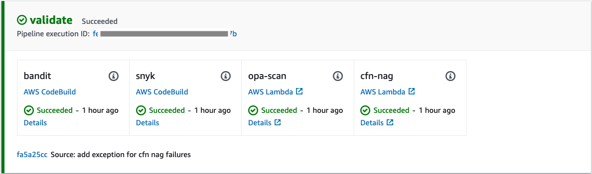
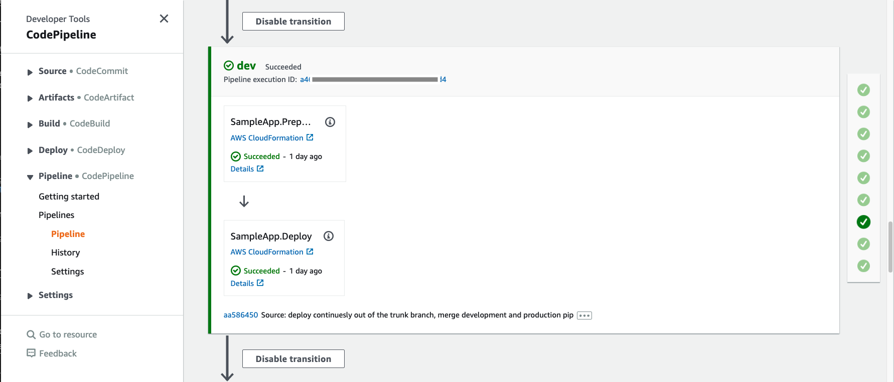

# DevSecOps Quick Start

This artefact helps development teams to quickly set up a ready to use environment integrated with a
multi-account CI/CD pipeline following security and DevOps best practices.


Upon successful deployment, you will have:

- an AWS CodeCommit Git repository 
- an AWS Cloud9 development environment integrated with the code repository
- a multi-stage, multi-account CI/CD pipeline integrated with the code repository  
- pipeline integration with [Bandit](https://github.com/PyCQA/bandit) for finding common security issues in Python code 
- pipeline integration with [Snyk](https://snyk.io/) for continuously monitoring for vulnerabilities in your dependencies
- pipeline integration with [CFN NAG](https://github.com/stelligent/cfn_nag) to look for patterns in 
  CloudFormation templates that may indicate insecure infrastructure
- pipeline integration with [Open Policy Agent (OPA)](https://www.openpolicyagent.org/) that enables you define and
  enforce policies on infrastructure resources at development time   

## Clone the Repository
This repository contains `Git Submodules`. If cloning for the first time, make sure to use
`--recurse-submodules` flag to automatically initialize and update each submodule in the repository:

```
git clone --recurse-submodules https://github.com/aws-samples/devsecops-quickstart.git
```

If you have cloned the previous version of the repository before the addition of submodules,
you can initialize and update the submodules using the following command:

```
git submodule update --init --recursive
``` 

For more information on working with repositories with `Git Submodules`, please refere to 
[here](https://git-scm.com/book/en/v2/Git-Tools-Submodules).

## Set Up

### 1. Create Python environment
This project is set up like a standard Python project.  The initialization
process also creates a virtualenv within this project, stored under the `.venv`
directory.  To create the virtualenv it assumes that there is a `python3`
(or `python` for Windows) executable in your path with access to the `venv`
package. If for any reason the automatic creation of the virtualenv fails,
you can create the virtualenv manually.

To manually create a virtualenv on MacOS and Linux:

```
python3 -m venv .venv
```

After the init process completes and the virtualenv is created, you can use the following
step to activate your virtualenv.

```
source .venv/bin/activate
```

If you are a Windows platform, you would activate the virtualenv like this:

```
.venv\Scripts\activate.bat
```

Once the virtualenv is activated, you can install the required dependencies.

```
pip install -r requirements.txt
```

### 2. Configure accounts and regions
Update `cdk.json` with account number and region values to be used for toolchain, and deployment accounts. The current
setting has three deployment accounts for Dev, QA, and Prod, just as an example. You can add/remove deployment stages
in `cdk.json` config to adjust the pipeline according to your needs. 

### 3. Configure Snyk authentication token
For Snyk integration, you need to provide authentication token with a Snyk profile account. You can sign up for a
free Snyk account [here](https://app.snyk.io/login?cta=sign-up&loc=body&page=try-snyk). After sign up, you can get
your Auth Token from the Account Settings section in your profile.

Using the retrieved authentication token, use secret helper tool to securely store the authentication token 
in AWS Secret Manager in the toolchain account to share it with the deployment pipeline:
```
./create_secret_helper.sh snyk-auth-token <snyk-auth-token-value>
```

## Deploy
### 1. Bootstrap accounts

The toolchain account will host all the required tools deployed by this quick start. The Dev/QA/Prod accounts will 
be used as target accounts for deployment of your application(s).

Bootstrap the toolchain account. You only need to do this one time per environment where you want 
to deploy CDK applications.

Make sure you have credentials for the toolchain account in a profile named `toolchain-profile`.

```
cdk bootstrap \
  --profile toolchain-profile \
  --cloudformation-execution-policies arn:aws:iam::aws:policy/AdministratorAccess \
  aws://<toolchain-account>/<toolchain-region>
```

Bootstrap the target accounts. You only need to do this one time per environment where you want
to deploy CDK applications.

Make sure you have credentials for the development account in a profile named `dev-profile`.

```
cdk bootstrap \
  --profile dev-profile \
  --trust <toolchain-account> \
  --cloudformation-execution-policies arn:aws:iam::aws:policy/AdministratorAccess \
  aws://<dev-account>/<dev-region>
```

Repeat this step for QA and Prod accounts. 

### 2. Deploy CI/CD pipeline
Run the following command to deploy the development CI/CD pipeline. The pipeline will track changes from `main` branch as configured in 
`repository_branch` property in `cdk.json`.

```
cdk deploy devsecops-quickstart-cicd --profile toolchain-profile
```

Take note of the `devsecops-quickstart-cicd.repositoryurl` value in deployment outputs. 

### 3. Initialize the repository
The Git repository created and attached to the pipeline in previous step is empty. 
To start using the repository, you need to first seed it with the current project code. 
Use the repository URL from previous step.

```
git remote add origin <devsecops-quickstart-cicd.repositoryurl>
git checkout -b main
git add .
git commit -m "initial commit"
git push --set-upstream origin main
```

## Verify toolchain account
Login to the toolchain account in AWS Console. Select the same region you used for the deployment.
### 1. CodeCommit Repository

Navigate to AWS CodeCommit service, select Source/Repositories from the left navigation bar, and verify that a new repository has been created.


### 2. Cloud9 Environment
Navigate to AWS Cloud9 service, select Account Environments from the left navigation bar, and verify that a new Cloud9 environment has been created.


Note that `cloud9_admin` is the owner of the environment and Open IDE buttion is disabled. To access the 
Cloud9 environment, go to CloudFormation service, open `tooling-cloud9` stack, and select Outputs section from the top navigation bar.


Copy the `IDEURL` link and open it in a new __incognito__ browser tab. For Sign In select IAM User. For Account number use the `IDEAccount` value from stack outputs, and for IAM user use `AdminUserName`. The Password needs to be retrieved from AWS Secret Manager by following the link in `AdminPasswordSecretURL` and selecting Retrieve Secret Value under Secret Value section. After successful login, you get access to the Cloud9 environment.


### 3. CodePipeline
Navigate to AWS CodePipeline service, select Pipeline/Pipelines from the left navigation bar, and verify that a new pipeline has been created. 


Open the pipeline and scroll down to `validate` stage. This is the stage where all the validation steps will be run.



After validation you can see the deployment stage(s). The number of the stages correspond to the number of target accounts you have configured in the `cdk.json` file as described in the __Deploy__ section. 



If you have enabled manual approvals in the stage configuration in `cdk.json`, the corresponding pipeline stage will have a mandatory manual approval before deploying to that environment.


## Verify target account(s)
For each target account, login to the account in AWS Console. Make sure you are in the same region as you used for the deployment. Navigate to CloudFormation service and search for the application stack that is deployed by the pipeline. This pipeline comes with a sample application called `SampleApp` which is deployed for demonstration purposes. You can add your application stacks following the same approach and the pipeline will take care of deploying them into your target environments.


## Troubleshooting
#### Q: How to access the Cloud9 Environment?
A: Check the CloudFormation Outputs section of the stack called `tooling-Cloud9`. There you can find output parameters
for the environment URL, admin user, and the AWS Secret Manager secret containing the admin password.

## Security

See [CONTRIBUTING](CONTRIBUTING.md#security-issue-notifications) for more information.

## License

This library is licensed under the MIT-0 License. See the LICENSE file.
