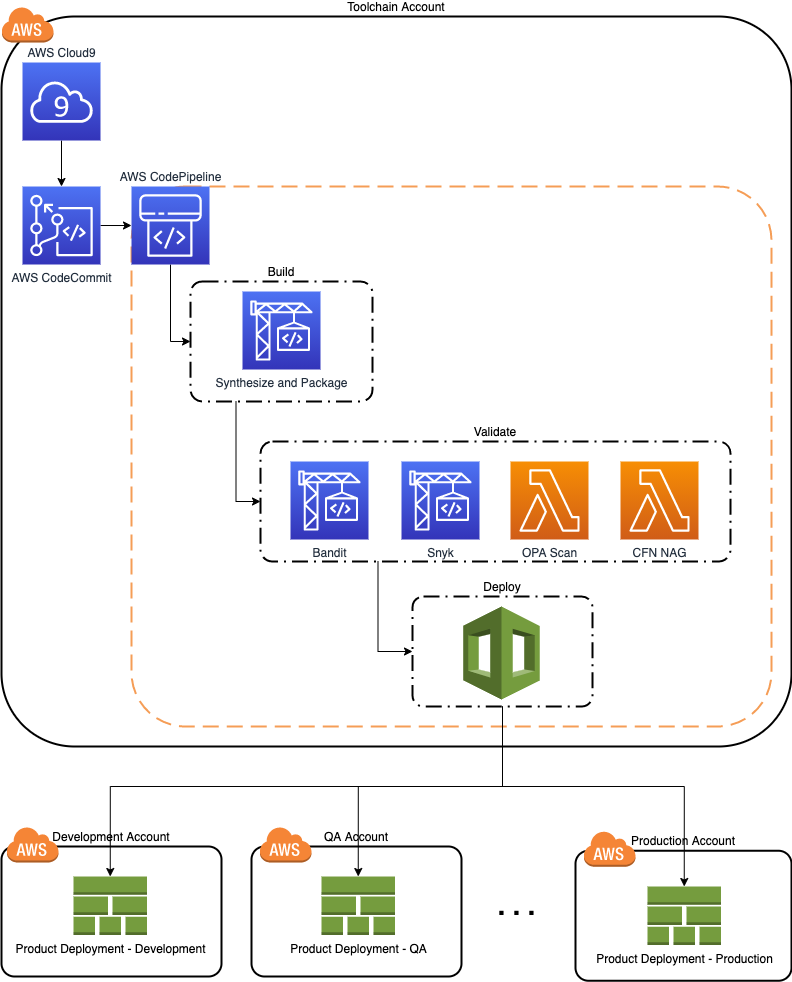
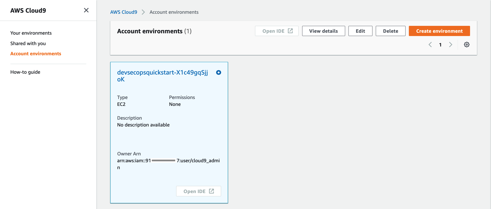
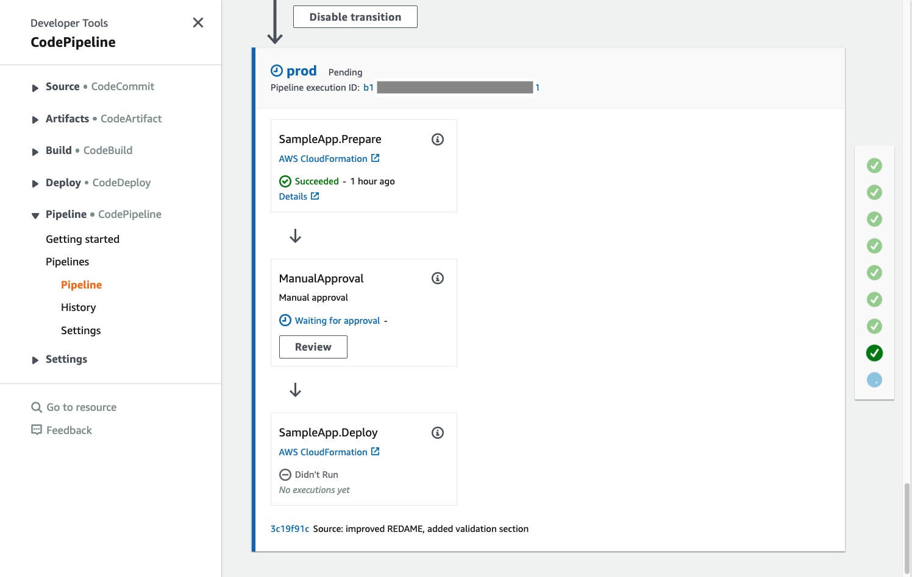

## DevSecOps Quick Start

This artefact helps development teams to quickly set up a ready to use environment integrated with a
multi-account CI/CD pipeline following security and DevOps best practices.



Upon successful deployment, you will have:

- an AWS CodeCommit Git repository 
- an AWS Cloud9 development environment integrated with the code repository
- a multi-stage, multi-account CI/CD pipeline integrated with the code repository  
- pipeline integration with [Bandit](https://github.com/PyCQA/bandit) for finding common security issues in Python code 
- pipeline integration with [Snyk](https://snyk.io/) for continuously monitoring for vulnerabilities in your dependencies
- pipeline integration with [CFN NAG](https://github.com/stelligent/cfn_nag) to look for patterns in 
  CloudFormation templates that may indicate insecure infrastructure
- pipeline integration with [Open Policy Agent (OPA)](https://www.openpolicyagent.org/) that enables you define and
  enforce policies on infrastructure resources at development time   

### Set Up

This project is set up like a standard Python project.  The initialization
process also creates a virtualenv within this project, stored under the `.venv`
directory.  To create the virtualenv it assumes that there is a `python3`
(or `python` for Windows) executable in your path with access to the `venv`
package. If for any reason the automatic creation of the virtualenv fails,
you can create the virtualenv manually.

To manually create a virtualenv on MacOS and Linux:

```
$ python3 -m venv .venv
```

After the init process completes and the virtualenv is created, you can use the following
step to activate your virtualenv.

```
$ source .venv/bin/activate
```

If you are a Windows platform, you would activate the virtualenv like this:

```
% .venv\Scripts\activate.bat
```

Once the virtualenv is activated, you can install the required dependencies.

```
$ pip install -r requirements.txt
```

### Define Account IDs and Regions
Update `cdk.json` with account number and region values to be used for toolchain, and deployment accounts. The current
setting has three deployment accounts for Dev, QA, and Prod, just as an example. You can add/remove deployment stages
in `cdk.json` config to adjust the pipeline according to your needs. 

### Bootstrap

The toolchain account will host all the required tools deployed by this quick start. The Dev/QA/Prod accounts will 
be used as target accounts for deployment of your application(s).

Bootstrap the toolchain account. You only need to do this one time per environment where you want 
to deploy CDK applications.

Make sure you have credentials for the toolchain account in a profile named `toolchain-profile`.

```
$ cdk bootstrap \
  --profile toolchain-profile \
  --cloudformation-execution-policies arn:aws:iam::aws:policy/AdministratorAccess \
  aws://<toolchain-account>/<toolchain-region>
```

Bootstrap the target accounts. You only need to do this one time per environment where you want
to deploy CDK applications.

Make sure you have credentials for the development account in a profile named `dev-profile`.

```
$ cdk bootstrap \
  --profile dev-profile \
  --trust <toolchain-account> \
  --cloudformation-execution-policies arn:aws:iam::aws:policy/AdministratorAccess \
  aws://<dev-account>/<dev-region>
```

Repeat this step for QA and Prod accounts. 

### Deploy
#### Snyk
For Snyk integration, you need to provide authentication token with a Snyk profile account. You can sign up for a
free Snyk account [here](https://app.snyk.io/login?cta=sign-up&loc=body&page=try-snyk). After sign up, you can get
your Auth Token from the Account Settings section in your profile.

Using the retrieved authentication token, use secret helper tool to securely store the authentication token 
in AWS Secret Manager in the toolchain account to share it with the deployment pipeline:
```
$ ./create_secret_helper.sh snyk-auth-token <snyk-auth-token-value>
```

#### OPA Scan
Run the following command to deploy OPA Scan stack into toolchain account.

```
$ cdk deploy devsecops-quickstart-opa-scan --profile toolchain-profile
```

#### Cfn Nag
Run the following command to deploy Cfn Nag stack into toolchain account.

```
$ cdk deploy devsecops-quickstart-cfn-nag --profile toolchain-profile
```

#### CI/CD Pipeline - Development
Run the following command to deploy the development CI/CD pipeline. The development pipeline will track changes from
`development_branch` and deploys to Dev account as configured in `cdk.json`.

```
$ cdk deploy devsecops-quickstart-cicd-development --profile toolchain-profile
```

Take note of the `devsecops-quickstart-cicd-development.repositoryurl` value in the deployment output section.

Initiate git and commit to the new repository.
```
$ git init
$ git remote add origin https://git-codecommit.eu-central-1.amazonaws.com/v1/repos/devsecops-quickstart
$ git checkout -b development
$ git add .
$ git commit -m "initial commit"
$ git push --set-upstream origin development
```





#### CI/CD Pipeline - Production
Run the following command to deploy the production CI/CD pipeline. The production pipeline will track changes from
`production_branch` and deploys to QA and Prod account as configured in `cdk.json`.

```
$ cdk deploy devsecops-quickstart-production --profile toolchain-profile
```




## Troubleshooting
#### Q: How to access the Cloud9 Environment?
A: Check the CloudFormation Outputs section of the stack called `tooling-Cloud9`. There you can find output parameters
for the environment URL, admin user, and the AWS Secret Manager secret containing the admin password.

#### Q: KMS Key error when deploying `devsecops-quickstart-cicd-development` after the latest update.
A: The role names in `devsecops-quickstart-opa-scan` and `devsecops-quickstart-cfn-nag` stacks has changed. If you get an error stating `Policy contains a statement with one or more invalid principals`, redeploy OPA-Scan and Cfn-Nag stacks to have the new roles deployed first before being addressed in the KMS Key policy. 

`cdk deploy devsecops-quickstart-opa-scan --profile toolchain-profile`

`cdk deploy devsecops-quickstart-cfn-nag --profile toolchain-profile`


#### Q: Cfn-Nag execution error when triggered by the pipeline.
A: AWS Lambda runtime no longer supports Ruby2.5, but the current Cfn-Nag package available on AWS Serverless Application Repository, on which we also depend here in the pipeline, requires Ruby2.5 runtime (open issue on Cfn-Nag: https://github.com/stelligent/cfn_nag/issues/588)

## Security

See [CONTRIBUTING](CONTRIBUTING.md#security-issue-notifications) for more information.

## License

This library is licensed under the MIT-0 License. See the LICENSE file.
